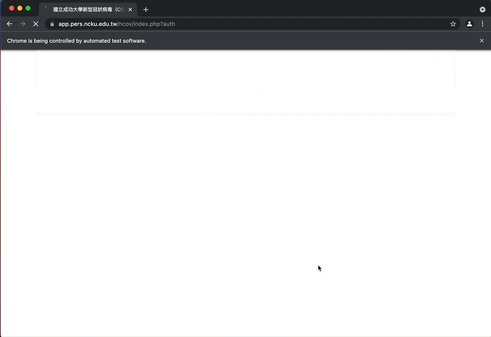

# NCKU Questionary Automation

Daily body temperature and symptom record tracking

## About
This tool is for NCKU students or staff member to automatically submit temperature and footprint status to school questionary system.



## Setup
Bring your own [webdriver](https://chromedriver.storage.googleapis.com/index.html) for this tool. Chrome is preferred. (default driver is located at `./chrome_drivers/chromedriver.mac64_m1`)

Edit `.env` as follow, we can use pipenv to load these values.
```
STUDENT_ID=
PASSWORD=
WEBDRIVER={path of webdriver / relative or absolute}
```

Python dependencies are required. Please use `pyenv` to install python3.9 and use `pipenv` to install tool dependencies.

```
# in project root
pyenv install 3.9.1
pyenv local 3.9.1
pip install pipenv
pipenv --python $(pyenv which python)
pipenv install
pipenv run automator/main.py  # run
```

*above script is not mandatory, if you know the drill, you can set it up by yourself.*

## Further instruction
Setup cronjob to automate this script.

## Contributing

Contributing to this repo is welcome.
* Submit issues or PRs

## Author
Chai-Shi Chang (changchaishi@gmail.com)
